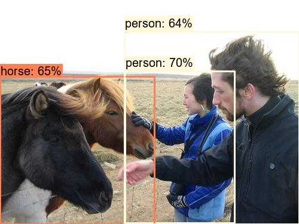
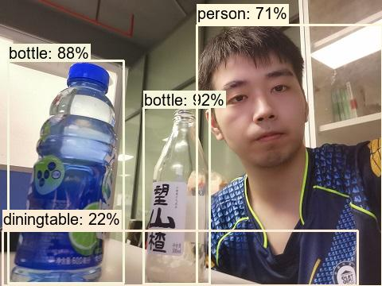
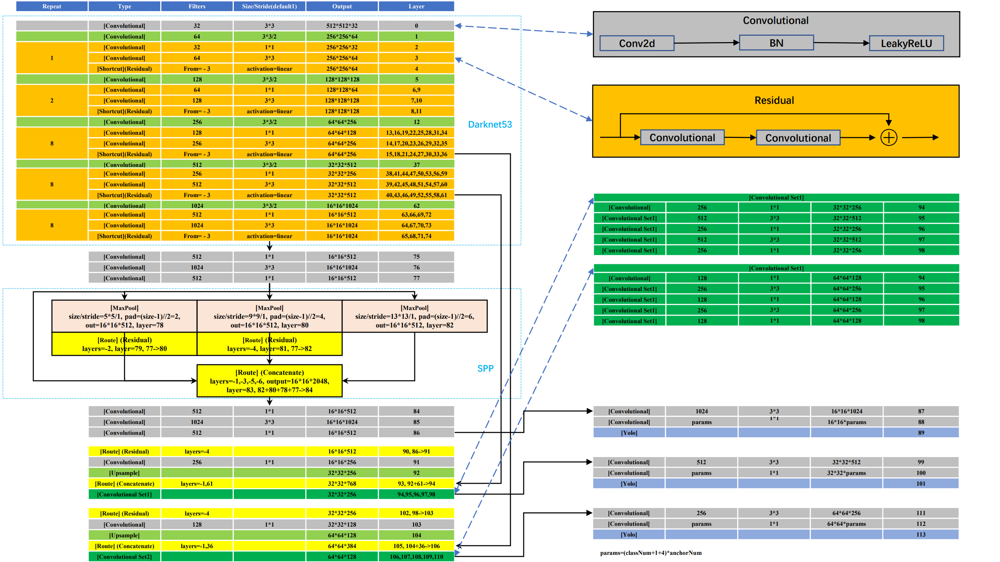

# YOLOv3SPP

## 1.文件结构

初始必须文件

```
README.md
requirements.txt
trans_voc2yolo.py
calculate_dataset.py
cfg
└─yolov3-spp.cfg

train_utils/
build_utils/
models.py
train.py
train_multi_GPU.py

predict_test.py
draw_box_utils.py
```

最终文件夹

```
    ├── architecture/: 网络结构展示图
    │ 
    ├── build_utils/: 搭建训练网络时使用到的工具
    │     ├── datasets.py: 数据读取以及预处理方法
    │     ├── img_utils.py: 部分图像处理方法
    │     ├── layers.py: 实现的一些基础层结构
    │     ├── parse_config.py: 解析yolov3-spp.cfg文件
    │     ├── torch_utils.py: 使用pytorch实现的一些工具
    │     └── utils.py: 训练网络过程中使用到的一些方法
    │ 
    ├── cfg/: 配置文件目录
    │    ├── hyp.yaml: 训练网络的相关超参数
    │    ├── my_yolov3.cfg: 训练网络的相关超参数
    │    └── yolov3-spp.cfg: yolov3-spp网络结构配置 
    │ 
    ├── data/: 存储训练时数据集相关信息缓存
    │    └── pascal_voc_classes.json: pascal voc数据集标签
    │ 
    ├── my_yolo_dataset/: 自定义数据集根目录
    │         ├── train   训练集目录
    │         │     ├── images  训练集图像目录
    │         │     └── labels  训练集标签目录 
    │         └── val    验证集目录
    │               ├── images  验证集图像目录
    │               └── labels  验证集标签目录   
    │ 
    ├── runs/: 保存训练过程中生成的所有tensorboard相关文件
    │
    ├── train_utils/: 训练验证网络时使用到的工具(包括多GPU训练以及使用cocotools)
    │ 
    ├── weights/: 所有相关预训练权重(下面会给出百度云的下载地址)
    │ 
    ├── requirements.txt: 需要安装的依赖包
    ├── trans_voc2yolo.py: 将voc数据集标注信息(.xml)转为yolo标注格式(.txt)
    ├── calculate_dataset.py: 1)统计训练集和验证集的数据并生成相应.txt文件
    │                         2)创建data.data文件
    │                         3)根据yolov3-spp.cfg结合数据集类别数创建my_yolov3.cfg文件
    ├── model.py: 模型搭建文件
    ├── train.py: 针对单GPU或者CPU的用户使用
    ├── train_multi_GPU.py: 针对使用多GPU的用户使用
    ├── predict_test.py: 简易的预测脚本，使用训练好的权重进行预测测试
    ├── draw_box_utils.py: 绘制目标边界框，绘制类别和概率信息
    ├── validation.py: 调用训练好的模型权重去计算验证集/测试集的COCO指标以及每个类别的mAP(IoU=0.5)
    |
    ├── results20221010-002413.txt: 训练结果记录
    ├── test*.jpg: 目标检测测试图片
    └── test*_predict.jpg: 目标检测预测结果
```

## 2.准备

### 2.1.安装必要的库

```bash
pip install -r requirements.txt 
```

### 2.2.数据准备

#### Step1.数据下载或自己收集标注：

- `Pascal VOC2012` train/val 数据集下载地址：http://host.robots.ox.ac.uk/pascal/VOC/voc2012/VOCtrainval_11-May-2012.tar
- 如果不了解数据集或者想使用自己的数据集进行训练，参考bilibili：https://b23.tv/F1kSCK

下载后数据解压放入 `./data/` 文件夹：

```bash
data
└─VOCdevkit
    └─VOC2012
        ├─Annotations
        ├─ImageSets
        │  ├─Action
        │  ├─Layout
        │  ├─Main
        │  └─Segmentation
        ├─JPEGImages
        ├─SegmentationClass
        └─SegmentationObject
```


#### Step2.VOC格式转YOLO格式

- 这里建议标注数据时直接生成 yolo 格式的标签文件`.txt`，推荐使用免费开源的标注软件(支持yolo格式)，https://github.com/tzutalin/labelImg
- 如果之前已经标注成 pascal voc 的 `.xml` 格式了也没关系，使用voc转yolo格式的转化脚本 [`.\trans_voc2yolo.py`](.\trans_voc2yolo.py)
- 测试图像时最好将图像缩放到32的倍数
- 标注好的数据集请按照以下目录结构进行摆放:
```
├── my_yolo_dataset 自定义数据集根目录
│         ├── train   训练集目录
│         │     ├── images  训练集图像目录
│         │     └── labels  训练集标签目录 
│         └── val    验证集目录
│               ├── images  验证集图像目录
│               └── labels  验证集标签目录            
```

执行 `.\trans_voc2yolo.py` 脚本前，需要根据自己的路径修改以下参数
```python
# voc数据集根目录以及版本
voc_root = "./data/VOCdevkit"
voc_version = "VOC2012"

# 转换的训练集以及验证集对应txt文件，对应VOCdevkit/VOC2012/ImageSets/Main文件夹下的txt文件
train_txt = "train.txt"
val_txt = "val.txt"

# 转换后的文件保存目录
save_file_root = "/home/wz/my_project/my_yolo_dataset"

# label标签对应json文件
label_json_path = './data/pascal_voc_classes.json'
```

运行脚本 [`.\trans_voc2yolo.py`](.\trans_voc2yolo.py)：

```cmd
> python .\trans_voc2yolo.py
translate train file...: 100%|██████████████████████| 5717/5717 [00:06<00:00, 904.93it/s]
translate val file...: 100%|████████████████████████| 5823/5823 [00:06<00:00, 904.73it/s]
```

生成新的文件夹存储 训练+验证 的 图片+标签；json 生成标签名 txt 文件：

```bash
my_yolo_dataset
├─train
│  ├─images
│  └─labels
└─val
    ├─images
    └─labels

data
└─my_data_label.names
```

#### Step3.根据摆放好的数据集信息生成一系列相关准备文件

- 使用 [`calculate_dataset.py`](calculate_dataset.py) 脚本生成`my_train_data.txt`文件、`my_val_data.txt`文件以及`my_data.data`文件，并生成新的`my_yolov3.cfg`文件（修改 yolo 3组输出的最后conv1x1和yolo层的filters和classes）
- 执行脚本前，需要根据自己的路径修改以下参数
```python
# 训练集的labels目录路径
train_annotation_dir = "./my_yolo_dataset/train/labels"
# 验证集的labels目录路径
val_annotation_dir = "./my_yolo_dataset/val/labels"
# 上一步生成的my_data_label.names文件路径(如果没有该文件，可以自己手动编辑一个txt文档，然后重命名为.names格式即可)
classes_label = "./data/my_data_label.names"
# 原始yolov3-spp.cfg网络结构配置文件
cfg_path = "./cfg/yolov3-spp.cfg"
```

生成：

```bash
data
│  my_data.data
│  my_train_data.txt
│  my_val_data.txt

cfg
│  yolov3-spp.cfg
```

### 2.3.预训练权重下载（下载后放入 weights 文件夹中）

- `yolov3-spp-ultralytics-416.pt`: 链接: https://pan.baidu.com/s/1cK3USHKxDx-d5dONij52lA  密码: r3vm
- `yolov3-spp-ultralytics-512.pt`: 链接: https://pan.baidu.com/s/1k5yeTZZNv8Xqf0uBXnUK-g  密码: e3k1 以这个为例
- `yolov3-spp-ultralytics-608.pt`: 链接: https://pan.baidu.com/s/1GI8BA0wxeWMC0cjrC01G7Q  密码: ma3t

生成：

```bash
weights
│  yolov3-spp-ultralytics-512.pt
```

## 3.训练

- 单GPU训练，运行 [`train.py`](train.py)
```cmd
> python train.py
```
<details>
<summary>训练日志(点击打开)</summary>

```cmd
Namespace(amp=False, batch_size=4, cache_images=False, cfg='cfg/my_yolov3.cfg', data='data/my_data.data', device='cuda:0', epochs=30, freeze_layers=False, hyp='cfg/hyp.yaml', img_size=512, multi_scale=True, name='', notest=False, rect=False, savebest=False, single_cls=False, weights='./weights/yolov3-spp-ultralytics-512.pt')
Start Tensorboard with "tensorboard --logdir=runs", view at http://localhost:6006/
Using cuda device training.
Using multi_scale training, image range[320, 736]
Model Summary: 225 layers, 6.26756e+07 parameters, 6.26756e+07 gradients, 117.3 GFLOPS
Reading image shapes: 100%|█████████████████████████████████████████████████| 5717/5717 [00:21<00:00, 271.31it/s]
Caching labels (5717 found, 0 missing, 0 empty, 0 duplicate, for 5717 images): 100%|████████████████████████████████████████████████████████████████████████████| 5717/5717 [00:20<00:00, 282.32it/s]
Saving labels to my_yolo_dataset\train\labels.norect.npy for faster future loading
C:\Users\siat\AppData\Local\Programs\Python\Python38\lib\site-packages\numpy\lib\npyio.py:528: VisibleDeprecationWarning: Creating an ndarray from ragged nested sequences (which is a list-or-tuple of lists-or-tuples-or ndarrays with different lengths or shapes) is deprecated. If you meant to do this, you must specify 'dtype=object' when creating the ndarray.
  arr = np.asanyarray(arr)
Reading image shapes: 100%|█████████████████████████████████████████████████| 5823/5823 [00:21<00:00, 270.87it/s]
Caching labels (5823 found, 0 missing, 0 empty, 0 duplicate, for 5823 images): 100%|████████████████████████████████████████████████████████████████████████████| 5823/5823 [00:22<00:00, 261.83it/s]
Saving labels to my_yolo_dataset\val\labels.rect.npy for faster future loading
loading eval info for coco tools.: 100%|████████████████████████████████████| 5823/5823 [00:03<00:00, 1901.16it/s]
creating index...
index created!
starting traning for 30 epochs...
Using 4 dataloader workers  
Epoch: [0]  [   0/1430]  eta: 4:36:45.717077  lr: 0.000001  loss: 12.2886 (12.2886)  box_loss: 4.3075 (4.3075)  obj_loss: 4.0815 (4.0815)  class_loss: 3.8997 (3.8997)  time: 11.6124  data: 10.1978  max mem: 1504
Epoch: [0]  [  50/1430]  eta: 0:08:42.086893  lr: 0.000051  loss: 15.4671 (17.4644)  box_loss: 5.8016 (7.3110)  obj_loss: 4.0433 (4.4851)  class_loss: 5.6222 (5.6683)  time: 0.1600  data: 0.0000  max mem: 1927
Epoch: [0]  [ 100/1430]  eta: 0:05:51.698931  lr: 0.000101  loss: 16.2317 (15.8204)  box_loss: 5.0005 (6.3099)  obj_loss: 5.9717 (4.0152)  class_loss: 5.2595 (5.4953)  time: 0.1634  data: 0.0001  max mem: 1927
Epoch: [0]  [ 150/1430]  eta: 0:04:45.879074  lr: 0.000151  loss: 11.9936 (14.7216)  box_loss: 4.0065 (5.7115)  obj_loss: 3.1215 (3.7287)  class_loss: 4.8656 (5.2813)  time: 0.1286  data: 0.0003  max mem: 1927
Epoch: [0]  [ 200/1430]  eta: 0:04:11.802493  lr: 0.000201  loss: 10.1379 (13.7462)  box_loss: 3.8888 (5.3022)  obj_loss: 1.3835 (3.4477)  class_loss: 4.8655 (4.9962)  time: 0.1531  data: 0.0000  max mem: 1928
Epoch: [0]  [ 250/1430]  eta: 0:03:50.063722  lr: 0.000251  loss: 13.2861 (13.0547)  box_loss: 4.0570 (5.0230)  obj_loss: 4.7465 (3.2761)  class_loss: 4.4826 (4.7557)  time: 0.1519  data: 0.0001  max mem: 1928
Epoch: [0]  [ 300/1430]  eta: 0:03:31.005391  lr: 0.000301  loss: 6.8837 (12.6040)  box_loss: 2.6164 (4.8670)  obj_loss: 1.3920 (3.1670)  class_loss: 2.8754 (4.5701)  time: 0.1378  data: 0.0001  max mem: 1928
Epoch: [0]  [ 350/1430]  eta: 0:03:15.696368  lr: 0.000351  loss: 12.2199 (12.1647)  box_loss: 4.7102 (4.7227)  obj_loss: 3.6618 (3.0500)  class_loss: 3.8479 (4.3920)  time: 0.1413  data: 0.0001  max mem: 1928
Epoch: [0]  [ 400/1430]  eta: 0:03:00.413212  lr: 0.000401  loss: 9.5387 (11.9015)  box_loss: 4.1492 (4.6406)  obj_loss: 2.1561 (3.0131)  class_loss: 3.2334 (4.2477)  time: 0.1371  data: 0.0001  max mem: 1928
Epoch: [0]  [ 450/1430]  eta: 0:02:48.403873  lr: 0.000451  loss: 8.4980 (11.6412)  box_loss: 4.0411 (4.5796)  obj_loss: 1.8210 (2.9508)  class_loss: 2.6359 (4.1108)  time: 0.1469  data: 0.0002  max mem: 1928
Epoch: [0]  [ 500/1430]  eta: 0:02:36.852588  lr: 0.000500  loss: 9.9502 (11.4218)  box_loss: 4.9807 (4.5234)  obj_loss: 2.0427 (2.9071)  class_loss: 2.9269 (3.9913)  time: 0.1456  data: 0.0000  max mem: 1928
Epoch: [0]  [ 550/1430]  eta: 0:02:26.753110  lr: 0.000550  loss: 9.9452 (11.2394)  box_loss: 5.0689 (4.4885)  obj_loss: 2.5205 (2.8744)  class_loss: 2.3559 (3.8766)  time: 0.1502  data: 0.0002  max mem: 1928
Epoch: [0]  [ 600/1430]  eta: 0:02:16.841047  lr: 0.000600  loss: 8.0674 (11.0586)  box_loss: 3.1892 (4.4613)  obj_loss: 2.7865 (2.8418)  class_loss: 2.0917 (3.7555)  time: 0.1476  data: 0.0002  max mem: 1928
Epoch: [0]  [ 650/1430]  eta: 0:02:08.084326  lr: 0.000650  loss: 10.2937 (10.8838)  box_loss: 5.3927 (4.4287)  obj_loss: 1.9890 (2.8081)  class_loss: 2.9120 (3.6470)  time: 0.1655  data: 0.0001  max mem: 1928
Epoch: [0]  [ 700/1430]  eta: 0:01:58.299893  lr: 0.000700  loss: 9.0436 (10.7911)  box_loss: 3.8717 (4.4120)  obj_loss: 2.0974 (2.7974)  class_loss: 3.0745 (3.5817)  time: 0.1318  data: 0.0001  max mem: 1928
Epoch: [0]  [ 750/1430]  eta: 0:01:49.576643  lr: 0.000750  loss: 9.6678 (10.7083)  box_loss: 4.6538 (4.4149)  obj_loss: 1.8386 (2.7721)  class_loss: 3.1755 (3.5213)  time: 0.1503  data: 0.0003  max mem: 1928
Epoch: [0]  [ 800/1430]  eta: 0:01:41.080828  lr: 0.000800  loss: 6.4908 (10.6046)  box_loss: 2.4286 (4.3871)  obj_loss: 1.8384 (2.7534)  class_loss: 2.2238 (3.4640)  time: 0.1409  data: 0.0002  max mem: 1928
Epoch: [0]  [ 850/1430]  eta: 0:01:32.475382  lr: 0.000850  loss: 8.1022 (10.5454)  box_loss: 4.4849 (4.3844)  obj_loss: 1.6393 (2.7546)  class_loss: 1.9780 (3.4063)  time: 0.1336  data: 0.0002  max mem: 1928
Epoch: [0]  [ 900/1430]  eta: 0:01:23.819837  lr: 0.000900  loss: 9.8078 (10.4672)  box_loss: 3.7575 (4.3543)  obj_loss: 2.0060 (2.7468)  class_loss: 4.0443 (3.3660)  time: 0.1409  data: 0.0001  max mem: 1928
Epoch: [0]  [ 950/1430]  eta: 0:01:15.744081  lr: 0.000950  loss: 7.9755 (10.3806)  box_loss: 3.8514 (4.3357)  obj_loss: 2.1400 (2.7326)  class_loss: 1.9841 (3.3123)  time: 0.1522  data: 0.0002  max mem: 1928
Epoch: [0]  [1000/1430]  eta: 0:01:07.763486  lr: 0.001000  loss: 9.4261 (10.3216)  box_loss: 4.1563 (4.3286)  obj_loss: 2.9506 (2.7142)  class_loss: 2.3192 (3.2788)  time: 0.1760  data: 0.0003  max mem: 1928
Epoch: [0]  [1050/1430]  eta: 0:00:59.465211  lr: 0.001000  loss: 7.1641 (10.2801)  box_loss: 3.0236 (4.3138)  obj_loss: 0.9948 (2.7153)  class_loss: 3.1457 (3.2509)  time: 0.1389  data: 0.0000  max mem: 1928
Epoch: [0]  [1100/1430]  eta: 0:00:51.475159  lr: 0.001000  loss: 9.0383 (10.2174)  box_loss: 3.3434 (4.2965)  obj_loss: 2.3990 (2.7083)  class_loss: 3.2959 (3.2126)  time: 0.1375  data: 0.0000  max mem: 1928
Epoch: [0]  [1150/1430]  eta: 0:00:43.536825  lr: 0.001000  loss: 7.9867 (10.1627)  box_loss: 3.5094 (4.2766)  obj_loss: 1.2082 (2.7072)  class_loss: 3.2691 (3.1789)  time: 0.1305  data: 0.0001  max mem: 1928
Epoch: [0]  [1200/1430]  eta: 0:00:35.648295  lr: 0.001000  loss: 9.7733 (10.1101)  box_loss: 4.2357 (4.2589)  obj_loss: 2.7252 (2.7101)  class_loss: 2.8124 (3.1410)  time: 0.1373  data: 0.0001  max mem: 1928
Epoch: [0]  [1250/1430]  eta: 0:00:27.923886  lr: 0.001000  loss: 9.6219 (10.0370)  box_loss: 4.4532 (4.2406)  obj_loss: 2.7577 (2.6869)  class_loss: 2.4110 (3.1094)  time: 0.1503  data: 0.0001  max mem: 1928
Epoch: [0]  [1300/1430]  eta: 0:00:20.108001  lr: 0.001000  loss: 8.3396 (9.9960)  box_loss: 4.7253 (4.2324)  obj_loss: 1.6030 (2.6748)  class_loss: 2.0114 (3.0888)  time: 0.1393  data: 0.0001  max mem: 1928
Epoch: [0]  [1350/1430]  eta: 0:00:12.397596  lr: 0.001000  loss: 4.9843 (9.9347)  box_loss: 2.1631 (4.2144)  obj_loss: 1.5336 (2.6596)  class_loss: 1.2876 (3.0607)  time: 0.1475  data: 0.0001  max mem: 1928
Epoch: [0]  [1400/1430]  eta: 0:00:04.617452  lr: 0.001000  loss: 6.5513 (9.8972)  box_loss: 3.9002 (4.1993)  obj_loss: 1.2863 (2.6628)  class_loss: 1.3648 (3.0351)  time: 0.1260  data: 0.0001  max mem: 1928
Epoch: [0]  [1429/1430]  eta: 0:00:00.153446  lr: 0.001000  loss: 2.8432 (9.8644)  box_loss: 0.3334 (4.1891)  obj_loss: 0.8771 (2.6596)  class_loss: 1.6327 (3.0157)  time: 0.1320  data: 0.0001  max mem: 1928
Epoch: [0] Total time: 0:03:39 (0.1537 s / it)
Test:   [   0/1456]  eta: 4:31:39.337406  model_time: 0.8382 (0.8382)  evaluator_time: 0.0090 (0.0090)  time: 11.1946  data: 10.3354  max mem: 1928
Test:   [ 100/1456]  eta: 0:03:58.265341  model_time: 0.0520 (0.0579)  evaluator_time: 0.0050 (0.0110)  time: 0.0652  data: 0.0001  max mem: 1928
Test:   [ 200/1456]  eta: 0:02:30.185605  model_time: 0.0509 (0.0544)  evaluator_time: 0.0100 (0.0095)  time: 0.0629  data: 0.0001  max mem: 1928
Test:   [ 300/1456]  eta: 0:01:56.836486  model_time: 0.0519 (0.0533)  evaluator_time: 0.0080 (0.0093)  time: 0.0652  data: 0.0001  max mem: 1928
Test:   [ 400/1456]  eta: 0:01:37.747465  model_time: 0.0599 (0.0534)  evaluator_time: 0.0060 (0.0092)  time: 0.0712  data: 0.0000  max mem: 1928
Test:   [ 500/1456]  eta: 0:01:24.951496  model_time: 0.0609 (0.0548)  evaluator_time: 0.0060 (0.0093)  time: 0.0735  data: 0.0000  max mem: 1928
Test:   [ 600/1456]  eta: 0:01:14.126439  model_time: 0.0589 (0.0557)  evaluator_time: 0.0060 (0.0096)  time: 0.0723  data: 0.0002  max mem: 1928
Test:   [ 700/1456]  eta: 0:01:03.939680  model_time: 0.0599 (0.0563)  evaluator_time: 0.0080 (0.0094)  time: 0.0717  data: 0.0001  max mem: 1928
Test:   [ 800/1456]  eta: 0:00:54.551606  model_time: 0.0589 (0.0568)  evaluator_time: 0.0200 (0.0093)  time: 0.0740  data: 0.0001  max mem: 1928
Test:   [ 900/1456]  eta: 0:00:45.808428  model_time: 0.0599 (0.0573)  evaluator_time: 0.0050 (0.0095)  time: 0.0734  data: 0.0002  max mem: 1928
Test:   [1000/1456]  eta: 0:00:37.222122  model_time: 0.0629 (0.0575)  evaluator_time: 0.0090 (0.0096)  time: 0.0748  data: 0.0000  max mem: 1928
Test:   [1100/1456]  eta: 0:00:28.780267  model_time: 0.0569 (0.0577)  evaluator_time: 0.0090 (0.0096)  time: 0.0697  data: 0.0001  max mem: 1928
Test:   [1200/1456]  eta: 0:00:20.907989  model_time: 0.1389 (0.0595)  evaluator_time: 0.0130 (0.0094)  time: 0.1513  data: 0.0001  max mem: 4825
Test:   [1300/1456]  eta: 0:00:13.624042  model_time: 0.1398 (0.0658)  evaluator_time: 0.0120 (0.0094)  time: 0.1555  data: 0.0000  max mem: 4825
Test:   [1400/1456]  eta: 0:00:05.155992  model_time: 0.1389 (0.0712)  evaluator_time: 0.0100 (0.0093)  time: 0.1498  data: 0.0000  max mem: 4825
Test:   [1455/1456]  eta: 0:00:00.094179  model_time: 0.0360 (0.0737)  evaluator_time: 0.0070 (0.0092)  time: 0.1423  data: 0.0000  max mem: 4825
Test:  Total time: 0:02:17 (0.0944 s / it)
Averaged stats: model_time: 0.0360 (0.0737)  evaluator_time: 0.0070 (0.0092)
Accumulating evaluation results...
DONE (t=2.80s).
IoU metric: bbox
 Average Precision  (AP) @[ IoU=0.50:0.95 | area=   all | maxDets=100 ] = 0.151
 Average Precision  (AP) @[ IoU=0.50      | area=   all | maxDets=100 ] = 0.389
 Average Precision  (AP) @[ IoU=0.75      | area=   all | maxDets=100 ] = 0.083
 Average Precision  (AP) @[ IoU=0.50:0.95 | area= small | maxDets=100 ] = 0.029
 Average Precision  (AP) @[ IoU=0.50:0.95 | area=medium | maxDets=100 ] = 0.110
 Average Precision  (AP) @[ IoU=0.50:0.95 | area= large | maxDets=100 ] = 0.192
 Average Recall     (AR) @[ IoU=0.50:0.95 | area=   all | maxDets=  1 ] = 0.193
 Average Recall     (AR) @[ IoU=0.50:0.95 | area=   all | maxDets= 10 ] = 0.387
 Average Recall     (AR) @[ IoU=0.50:0.95 | area=   all | maxDets=100 ] = 0.413
 Average Recall     (AR) @[ IoU=0.50:0.95 | area= small | maxDets=100 ] = 0.071
 Average Recall     (AR) @[ IoU=0.50:0.95 | area=medium | maxDets=100 ] = 0.334
 Average Recall     (AR) @[ IoU=0.50:0.95 | area= large | maxDets=100 ] = 0.464

...

Epoch: [29]  [   0/1430]  eta: 4:30:46.798091  lr: 0.000013  loss: 4.0559 (4.0559)  box_loss: 1.5493 (1.5493)  obj_loss: 2.0795 (2.0795)  class_loss: 0.4270 (0.4270)  time: 11.3614  data: 10.9418  max mem: 4825
Epoch: [29]  [  50/1430]  eta: 0:08:23.970091  lr: 0.000013  loss: 3.7420 (4.2867)  box_loss: 1.3645 (1.7168)  obj_loss: 1.7448 (1.9610)  class_loss: 0.6327 (0.6089)  time: 0.1741  data: 0.0002  max mem: 4825
Epoch: [29]  [ 100/1430]  eta: 0:05:24.675717  lr: 0.000013  loss: 6.8451 (4.6411)  box_loss: 1.8974 (1.7466)  obj_loss: 4.1849 (2.2542)  class_loss: 0.7629 (0.6403)  time: 0.0981  data: 0.0002  max mem: 4825
Epoch: [29]  [ 150/1430]  eta: 0:04:07.694468  lr: 0.000013  loss: 8.9983 (5.4481)  box_loss: 2.2292 (1.8192)  obj_loss: 6.0558 (2.8719)  class_loss: 0.7133 (0.7570)  time: 0.0885  data: 0.0001  max mem: 4825
Epoch: [29]  [ 200/1430]  eta: 0:03:32.658658  lr: 0.000013  loss: 2.1793 (5.4935)  box_loss: 0.8201 (1.8252)  obj_loss: 0.7896 (2.8920)  class_loss: 0.5696 (0.7762)  time: 0.1345  data: 0.0000  max mem: 4825
Epoch: [29]  [ 250/1430]  eta: 0:03:20.287461  lr: 0.000013  loss: 9.1421 (5.4681)  box_loss: 2.3433 (1.8251)  obj_loss: 5.4953 (2.8537)  class_loss: 1.3035 (0.7893)  time: 0.0937  data: 0.0000  max mem: 4825
Epoch: [29]  [ 300/1430]  eta: 0:03:04.392231  lr: 0.000013  loss: 4.0360 (5.4579)  box_loss: 2.0981 (1.8295)  obj_loss: 1.6107 (2.8327)  class_loss: 0.3272 (0.7957)  time: 0.1512  data: 0.0003  max mem: 4825
Epoch: [29]  [ 350/1430]  eta: 0:02:47.859499  lr: 0.000013  loss: 6.7211 (5.4847)  box_loss: 1.8577 (1.8156)  obj_loss: 2.6522 (2.8711)  class_loss: 2.2112 (0.7980)  time: 0.0974  data: 0.0001  max mem: 4825
Epoch: [29]  [ 400/1430]  eta: 0:02:42.181517  lr: 0.000013  loss: 2.4814 (5.3582)  box_loss: 0.9173 (1.8132)  obj_loss: 1.4281 (2.7374)  class_loss: 0.1361 (0.8077)  time: 0.1254  data: 0.0000  max mem: 4825
Epoch: [29]  [ 450/1430]  eta: 0:02:29.826224  lr: 0.000013  loss: 5.4284 (5.2689)  box_loss: 1.6861 (1.8067)  obj_loss: 2.0899 (2.6758)  class_loss: 1.6524 (0.7864)  time: 0.1103  data: 0.0001  max mem: 4825
Epoch: [29]  [ 500/1430]  eta: 0:02:17.826057  lr: 0.000013  loss: 6.2366 (5.2446)  box_loss: 1.6056 (1.8056)  obj_loss: 4.3380 (2.6505)  class_loss: 0.2930 (0.7884)  time: 0.1019  data: 0.0002  max mem: 4825
Epoch: [29]  [ 550/1430]  eta: 0:02:08.695233  lr: 0.000013  loss: 5.4021 (5.2216)  box_loss: 2.5743 (1.8111)  obj_loss: 0.7002 (2.6314)  class_loss: 2.1276 (0.7790)  time: 0.1351  data: 0.0001  max mem: 4825
Epoch: [29]  [ 600/1430]  eta: 0:02:02.552000  lr: 0.000013  loss: 5.9878 (5.1540)  box_loss: 2.0428 (1.8019)  obj_loss: 1.5919 (2.5789)  class_loss: 2.3531 (0.7731)  time: 0.1630  data: 0.0000  max mem: 4825
Epoch: [29]  [ 650/1430]  eta: 0:01:54.881829  lr: 0.000013  loss: 2.2227 (5.0872)  box_loss: 0.7072 (1.7911)  obj_loss: 1.0854 (2.5352)  class_loss: 0.4301 (0.7610)  time: 0.1651  data: 0.0002  max mem: 4825
Epoch: [29]  [ 700/1430]  eta: 0:01:46.843763  lr: 0.000013  loss: 4.3327 (5.0479)  box_loss: 1.6714 (1.7990)  obj_loss: 2.0732 (2.4922)  class_loss: 0.5882 (0.7567)  time: 0.1130  data: 0.0001  max mem: 4825
Epoch: [29]  [ 750/1430]  eta: 0:01:37.589524  lr: 0.000013  loss: 4.3380 (5.0768)  box_loss: 1.2880 (1.8058)  obj_loss: 2.7638 (2.5153)  class_loss: 0.2862 (0.7557)  time: 0.1063  data: 0.0001  max mem: 4825
Epoch: [29]  [ 800/1430]  eta: 0:01:29.806426  lr: 0.000013  loss: 3.3537 (5.0873)  box_loss: 1.2224 (1.7996)  obj_loss: 1.1120 (2.5256)  class_loss: 1.0194 (0.7620)  time: 0.1553  data: 0.0001  max mem: 4825
Epoch: [29]  [ 850/1430]  eta: 0:01:22.432632  lr: 0.000013  loss: 6.4742 (5.0849)  box_loss: 1.8956 (1.8008)  obj_loss: 3.8846 (2.5154)  class_loss: 0.6940 (0.7687)  time: 0.1157  data: 0.0002  max mem: 4825
Epoch: [29]  [ 900/1430]  eta: 0:01:14.048534  lr: 0.000013  loss: 7.9453 (5.1280)  box_loss: 1.6275 (1.8075)  obj_loss: 5.0103 (2.5507)  class_loss: 1.3075 (0.7699)  time: 0.0978  data: 0.0001  max mem: 4825
Epoch: [29]  [ 950/1430]  eta: 0:01:08.170162  lr: 0.000013  loss: 5.7528 (5.0657)  box_loss: 2.3393 (1.8004)  obj_loss: 1.0602 (2.5019)  class_loss: 2.3533 (0.7634)  time: 0.2309  data: 0.0001  max mem: 4825
Epoch: [29]  [1000/1430]  eta: 0:01:01.737129  lr: 0.000013  loss: 6.0301 (5.0277)  box_loss: 1.8653 (1.8017)  obj_loss: 3.8832 (2.4660)  class_loss: 0.2817 (0.7600)  time: 0.1774  data: 0.0002  max mem: 4825
Epoch: [29]  [1050/1430]  eta: 0:00:54.229692  lr: 0.000013  loss: 6.2586 (5.0167)  box_loss: 1.1415 (1.7994)  obj_loss: 2.5241 (2.4583)  class_loss: 2.5930 (0.7590)  time: 0.1382  data: 0.0002  max mem: 4825
Epoch: [29]  [1100/1430]  eta: 0:00:47.225130  lr: 0.000013  loss: 3.9074 (5.0068)  box_loss: 2.0518 (1.8001)  obj_loss: 1.4904 (2.4449)  class_loss: 0.3652 (0.7617)  time: 0.1708  data: 0.0001  max mem: 4825
Epoch: [29]  [1150/1430]  eta: 0:00:40.065285  lr: 0.000013  loss: 6.6903 (4.9894)  box_loss: 2.2029 (1.8008)  obj_loss: 3.5003 (2.4302)  class_loss: 0.9872 (0.7583)  time: 0.1399  data: 0.0001  max mem: 4825
Epoch: [29]  [1200/1430]  eta: 0:00:32.823371  lr: 0.000013  loss: 3.3997 (4.9883)  box_loss: 0.7890 (1.7998)  obj_loss: 2.4141 (2.4276)  class_loss: 0.1966 (0.7609)  time: 0.1163  data: 0.0000  max mem: 4825
Epoch: [29]  [1250/1430]  eta: 0:00:25.512954  lr: 0.000013  loss: 6.0530 (4.9791)  box_loss: 1.9295 (1.7977)  obj_loss: 3.4650 (2.4282)  class_loss: 0.6585 (0.7531)  time: 0.1171  data: 0.0002  max mem: 4825
Epoch: [29]  [1300/1430]  eta: 0:00:18.480907  lr: 0.000013  loss: 7.4648 (4.9607)  box_loss: 2.0881 (1.7957)  obj_loss: 3.0172 (2.4154)  class_loss: 2.3596 (0.7495)  time: 0.2050  data: 0.0001  max mem: 4825
Epoch: [29]  [1350/1430]  eta: 0:00:11.339841  lr: 0.000013  loss: 5.0944 (4.9570)  box_loss: 2.3734 (1.7953)  obj_loss: 1.9626 (2.4138)  class_loss: 0.7584 (0.7480)  time: 0.1316  data: 0.0001  max mem: 4825
Epoch: [29]  [1400/1430]  eta: 0:00:04.253389  lr: 0.000013  loss: 5.4721 (4.9657)  box_loss: 2.3655 (1.7993)  obj_loss: 2.6277 (2.4210)  class_loss: 0.4789 (0.7454)  time: 0.0947  data: 0.0000  max mem: 4825
Epoch: [29]  [1429/1430]  eta: 0:00:00.141866  lr: 0.000013  loss: 9.8583 (4.9716)  box_loss: 2.9139 (1.8023)  obj_loss: 4.5477 (2.4207)  class_loss: 2.3967 (0.7487)  time: 0.1651  data: 0.0001  max mem: 4825
Epoch: [29] Total time: 0:03:23 (0.1422 s / it)
Test:   [   0/1456]  eta: 5:06:10.478161  model_time: 0.2318 (0.2318)  evaluator_time: 0.0090 (0.0090)  time: 12.6171  data: 12.3713  max mem: 4825
Test:   [ 100/1456]  eta: 0:04:12.749649  model_time: 0.0509 (0.0512)  evaluator_time: 0.0060 (0.0087)  time: 0.0621  data: 0.0001  max mem: 4825
Test:   [ 200/1456]  eta: 0:02:36.365462  model_time: 0.0509 (0.0512)  evaluator_time: 0.0080 (0.0079)  time: 0.0631  data: 0.0001  max mem: 4825
Test:   [ 300/1456]  eta: 0:02:00.251135  model_time: 0.0510 (0.0511)  evaluator_time: 0.0060 (0.0080)  time: 0.0636  data: 0.0001  max mem: 4825
Test:   [ 400/1456]  eta: 0:01:39.773235  model_time: 0.0619 (0.0519)  evaluator_time: 0.0050 (0.0079)  time: 0.0706  data: 0.0002  max mem: 4825
Test:   [ 500/1456]  eta: 0:01:26.463208  model_time: 0.0579 (0.0535)  evaluator_time: 0.0070 (0.0084)  time: 0.0799  data: 0.0003  max mem: 4825
Test:   [ 600/1456]  eta: 0:01:15.316690  model_time: 0.0619 (0.0549)  evaluator_time: 0.0080 (0.0087)  time: 0.0748  data: 0.0002  max mem: 4825
Test:   [ 700/1456]  eta: 0:01:04.766585  model_time: 0.0599 (0.0557)  evaluator_time: 0.0080 (0.0085)  time: 0.0716  data: 0.0001  max mem: 4825
Test:   [ 800/1456]  eta: 0:00:55.114121  model_time: 0.0590 (0.0563)  evaluator_time: 0.0170 (0.0084)  time: 0.0730  data: 0.0000  max mem: 4825
Test:   [ 900/1456]  eta: 0:00:46.061521  model_time: 0.0600 (0.0568)  evaluator_time: 0.0050 (0.0085)  time: 0.0720  data: 0.0002  max mem: 4825
Test:   [1000/1456]  eta: 0:00:37.361641  model_time: 0.0599 (0.0572)  evaluator_time: 0.0090 (0.0086)  time: 0.0744  data: 0.0002  max mem: 4825
Test:   [1100/1456]  eta: 0:00:28.900945  model_time: 0.0560 (0.0573)  evaluator_time: 0.0070 (0.0088)  time: 0.0679  data: 0.0002  max mem: 4825
Test:   [1200/1456]  eta: 0:00:20.940164  model_time: 0.1409 (0.0591)  evaluator_time: 0.0090 (0.0085)  time: 0.1429  data: 0.0002  max mem: 4825
Test:   [1300/1456]  eta: 0:00:13.648848  model_time: 0.1469 (0.0655)  evaluator_time: 0.0090 (0.0085)  time: 0.1552  data: 0.0001  max mem: 4825
Test:   [1400/1456]  eta: 0:00:05.163081  model_time: 0.1409 (0.0710)  evaluator_time: 0.0100 (0.0085)  time: 0.1502  data: 0.0002  max mem: 4825
Test:   [1455/1456]  eta: 0:00:00.094302  model_time: 0.0350 (0.0734)  evaluator_time: 0.0050 (0.0084)  time: 0.1429  data: 0.0001  max mem: 4825
Test:  Total time: 0:02:17 (0.0946 s / it)
Averaged stats: model_time: 0.0350 (0.0734)  evaluator_time: 0.0050 (0.0084)
Accumulating evaluation results...
DONE (t=2.29s).
IoU metric: bbox
 Average Precision  (AP) @[ IoU=0.50:0.95 | area=   all | maxDets=100 ] = 0.577
 Average Precision  (AP) @[ IoU=0.50      | area=   all | maxDets=100 ] = 0.799
 Average Precision  (AP) @[ IoU=0.75      | area=   all | maxDets=100 ] = 0.636
 Average Precision  (AP) @[ IoU=0.50:0.95 | area= small | maxDets=100 ] = 0.190
 Average Precision  (AP) @[ IoU=0.50:0.95 | area=medium | maxDets=100 ] = 0.454
 Average Precision  (AP) @[ IoU=0.50:0.95 | area= large | maxDets=100 ] = 0.673
 Average Recall     (AR) @[ IoU=0.50:0.95 | area=   all | maxDets=  1 ] = 0.470
 Average Recall     (AR) @[ IoU=0.50:0.95 | area=   all | maxDets= 10 ] = 0.680
 Average Recall     (AR) @[ IoU=0.50:0.95 | area=   all | maxDets=100 ] = 0.694
 Average Recall     (AR) @[ IoU=0.50:0.95 | area= small | maxDets=100 ] = 0.311
 Average Recall     (AR) @[ IoU=0.50:0.95 | area=medium | maxDets=100 ] = 0.585
 Average Recall     (AR) @[ IoU=0.50:0.95 | area= large | maxDets=100 ] = 0.767
```
  
</details>

生成：

```bash
runs
└─time machine
    | tensorboardlog

data
| my_train_data.shapes
| my_val_data.shapes

weight
| yolov3spp-0.pt
| yolov3spp-1.pt
| ...
| yolov3spp-29.pt

resultsYMD-HMS.txt
```

- 多GPU训练，，运行 [`train_multi_GPU.py`](train_multi_GPU.py)，`nproc_per_node` 参数为使用GPU数量 （多GPU在 Windows 系统暂时没运行成功）
```cmd
> python -m torch.distributed.launch --nproc_per_node=8 --use_env train_multi_GPU.py
```
- 训练过程中保存的 `results.txt` 是每个epoch在验证集上的COCO指标，前12个值是COCO指标，后面两个值是训练平均损失以及学习率


## 4.预测

运行 [`predict_test.py`](predict_test.py)，注意修改测试图片路径：

```py
img_path = "test1.jpg"
```

```cmd
python predict_test.py
```

预测结果图





## 5.网络结构解读

1. `./cfg/my_yolo3.cfg` 网络结构参数设置
    <!--  -->
    <details>
    <summary>网络图(点击打开)</summary>
        
    </details>

2. `./build_utils/parse_config.py` 解析网络，返回一个网络参数的列表，一个元素代表一层，其每个元素是字典类型

3. `models.py` 搭建网络
    - `Darknet`
        - `parse_model_cfg` 函数解析 cfg 文件
        - `create_modules` 一层层搭建网络
            - `convolutional`
            - `maxpool`
            - `upsample`
            - `route`
            - `shortcut`
            - `yolo`
                - train return: [bs, anchor, grid, grid, xywh + obj + classes]
                - inference return: [bs, anchor * grid * grid, xywh + obj + classes], [bs, anchor, grid, grid, xywh + obj + classes]

4. `./build_utils/datasets.py`
    - `__init__`
        - 读取 data
        - 读取 labels
        - 生成图像的原始尺寸 shapes
        - 开启rect的话：重新排序，生成每个batch图像缩放后输入网络的shape值 batch_shapes
        - 循环读取 lablel 数据
            - 从 npy 或 原始文件 读取
            - 检验数据空否，格式（每行>5个元素，各个元素>0，后4个元素<1）对否，各行重复否
            - `if extract_bounding_boxes` 提取目标框用于其它任务，比如分类
        - 缓存 labled 数据到 npy 文件
        - `if cache_images` 缓存图片进内存，默认 False
        - `if detect_corrupted_images` 检查图片是否破损，默认 False
    - `__getitem__`
        - `if load_mosaic` 4张图像拼接（返回图像+标签）：
            - 随机中心点
            - 2h*2w [114,114,114] 填充获取每个图像的与前面中心点所对的点
            - 然后裁剪拼接
            - 重新计算拼接的 label
            - 数据增强 `random_affine` 随机仿射变换（随机旋转，缩放，平移以及错切；bbox重新计算）
        - 不用 `load_mosaic` 则直接读取数据（返回图像+标签）： 
            - 图像：计算 shape （如果 `rect` 则重新缩放 `img_size`，否则就使用原始图片大小）
            - 标签：相对坐标->绝对坐标，* 缩放ratio + 填充pad
        - 数据增强部分又进行了 仿射变换 + 标签：绝对坐标->相对坐标 + 水平上下翻转 + hsv增强
        - 返回：图像，标签，路径，图像大小，索引
    - `collate_fn`
        - 对于同一张图像的label第一维度（共6维）设置为相同
        - 返回：图像新增0维度，标签在0维度拼接

5. `train.py -> train_one_epoch -> compute_loss`
    - 5.1. `build_targets` 生成正样本
        - input：
            - `p`: 3个 yolo 层的输出 (bs, ch, gridh, gridw, nparams(xywh+obj+classes=4+1+20))
            - `targets`：(目标数，6(该batch中img_idx, class, x, y, w, h))
        - 根据 targets 和 yolo 的 anchors （3组wh）信息 iou > ioy_t，获得正样本anchor索引 a = [0, 1, 1, 2, ...], 匹配的正样本标签信息 t = [[imgidx, class, x, y, w, h], [...], ...]
        - return：
            - 类别列表；
            - gt box相对anchor的x,y偏移量以及w,h；
            - [imgidx, anchoridx, gridyidx, gridxidx]；
            - anchorWHs
    - 5.2. `BCEcls, BCEobj` 分类损失和置信度损失
    - 5.3. 计算损失
        - `lbox`：回归损失，计算预测的 xywh pbox, `bbox_iou` 计算 pbox & tbox 的 `GIoU` or `DIoU` or `CIoU` (PS. `IoU`：交并比；`GIoU`：IoU+加框；`DIoU`：IoU+加两个框中心点欧氏距离；`CIoU`：IoU+加两个框中心点欧氏距离+加长宽比)
        - `lobj`：置信度损失，计算pi[..., 4] & tobj  的 BCEobj
        - `lcls`：分类损失，计算 ps[:, 5:] & t 的 BCEcls

## 6.致谢

跟着 [霹雳吧啦Wz](https://space.bilibili.com/18161609) 学YOLO，参考：
- https://github.com/WZMIAOMIAO/deep-learning-for-image-processing/tree/master/pytorch_object_detection/yolov3_spp
- https://github.com/ultralytics/yolov3
- https://www.bilibili.com/video/BV1t54y1C7ra
